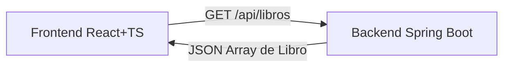

# Documento de Diseño: Libro CRUD MVP

## Visión general

Sistema fullstack mínimo para el hackathon: un backend Spring Boot que expone un endpoint REST con datos mockeados de libros, y un frontend React+TypeScript que los consume y muestra en tarjetas. Arquitectura simple cliente-servidor con comunicación JSON sobre HTTP.

## Arquitectura



- El Frontend se ejecuta en Vite dev server (puerto 5173 por defecto)
- El Backend se ejecuta en Spring Boot (puerto 8080 por defecto)
- Comunicación vía REST/JSON
- CORS configurado en el Backend para permitir peticiones del Frontend

## Componentes e Interfaces

### Backend (Java - Spring Boot)

**Modelo `Libro`** (paquete `etsisi.albertoynico.backend.model`):
```java
public class Libro {
    private Long id;
    private String autor;
    private String descripcion;
    private int anio;
}
```
Usa Lombok (`@Data`, `@AllArgsConstructor`, `@NoArgsConstructor`) para getters/setters/constructores.

**Controlador `LibroController`** (paquete `etsisi.albertoynico.backend.controller`):
```java
@RestController
@RequestMapping("/api/libros")
@CrossOrigin(origins = "*")
public class LibroController {
    @GetMapping
    public List<Libro> getLibros() { ... }
}
```
Devuelve una lista mockeada hardcodeada de libros.

### Frontend (React + TypeScript)

**Interfaz `Libro`** (`src/types/Libro.ts`):
```typescript
export interface Libro {
  id: number;
  autor: string;
  descripcion: string;
  anio: number;
}
```

**Servicio `libroService`** (`src/services/libroService.ts`):
```typescript
export async function getLibros(): Promise<Libro[]> {
  const res = await fetch("http://localhost:8080/api/libros");
  if (!res.ok) throw new Error("Error al cargar libros");
  return res.json();
}
```

**Componente `LibroCard`** (`src/components/LibroCard.tsx`):
- Props: `libro: Libro`
- Renderiza una tarjeta con autor, descripción y año

**Componente `LandingPage`** (`src/components/LandingPage.tsx`):
- Llama a `getLibros()` en `useEffect`
- Gestiona estados: cargando, error, datos
- Renderiza una `LibroCard` por cada libro

**`App.tsx`**:
- Renderiza `LandingPage` directamente, sin boilerplate de Vite

## Modelos de Datos

### Libro (JSON)

```json
{
  "id": 1,
  "autor": "Miguel de Cervantes",
  "descripcion": "Las aventuras de un hidalgo manchego",
  "anio": 1605
}
```

Campos:
| Campo | Tipo | Descripción |
|-------|------|-------------|
| id | number/Long | Identificador único |
| autor | string/String | Nombre del autor |
| descripcion | string/String | Descripción breve del libro |
| anio | number/int | Año de publicación |

## Propiedades de Corrección

*Una propiedad es una característica o comportamiento que debe cumplirse en todas las ejecuciones válidas de un sistema — esencialmente, una declaración formal sobre lo que el sistema debe hacer. Las propiedades sirven como puente entre especificaciones legibles por humanos y garantías de corrección verificables por máquinas.*

### Propiedad 1: Round-trip de serialización de Libro

*Para cualquier* objeto Libro válido, serializarlo a JSON y deserializarlo de vuelta a un objeto Libro debe producir un objeto equivalente al original.

**Valida: Requisitos 1.1, 1.2**

### Propiedad 2: Renderizado correcto de lista de libros

*Para cualquier* lista de libros de longitud N, la LandingPage debe renderizar exactamente N componentes LibroCard, y cada LibroCard debe contener el autor, la descripción y el año del libro correspondiente.

**Valida: Requisitos 3.2, 3.3**

## Manejo de Errores

| Escenario | Comportamiento |
|-----------|---------------|
| Backend no disponible | LandingPage muestra mensaje de error |
| Petición HTTP falla | `getLibros()` lanza excepción, LandingPage la captura y muestra error |
| Estado de carga | LandingPage muestra indicador mientras espera respuesta |

## Estrategia de Testing

### Tests unitarios
- **Backend**: Test del endpoint `GET /api/libros` con `MockMvc` verificando status 200, estructura JSON y cantidad mínima de libros
- **Frontend**: Tests de componentes con mocks del servicio HTTP

### Tests basados en propiedades
- Librería backend: jqwik (property-based testing para Java)
- Librería frontend: fast-check (property-based testing para TypeScript)
- Mínimo 100 iteraciones por test de propiedad
- Cada test debe referenciar su propiedad del diseño:
  - **Feature: libro-crud-mvp, Property 1: Round-trip de serialización de Libro**
  - **Feature: libro-crud-mvp, Property 2: Renderizado correcto de lista de libros**

### Enfoque dual
- Tests unitarios para ejemplos concretos, edge cases (estado de carga, error HTTP) y verificaciones de integración
- Tests de propiedades para validar comportamiento universal sobre todas las entradas posibles
- Ambos son complementarios y necesarios para cobertura completa
