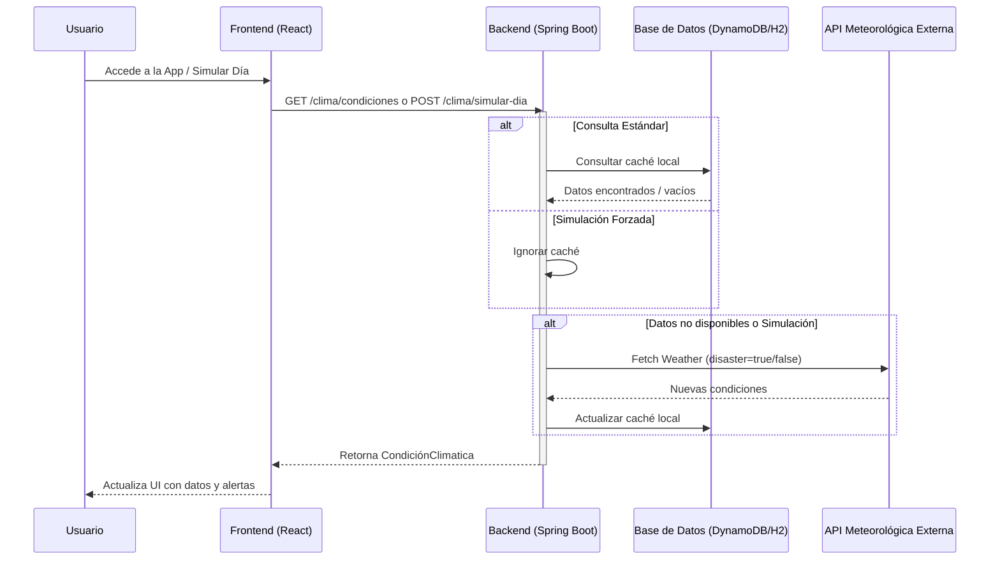

# ClimAlert: Sistema de Gestión de Alerta Climática

ClimAlert es una plataforma integral diseñada para la monitorización de condiciones meteorológicas y la gestión de alertas de seguridad ciudadana. El sistema permite a los usuarios estar informados sobre el clima actual y proporciona a las autoridades herramientas avanzadas para la toma de decisiones y la simulación de escenarios críticos.

## 👥 Roles del Sistema

El sistema cuenta con un sistema robusto de autenticación basado en JWT y distingue entre dos tipos de usuarios con permisos específicos:

### 1. Rol Ciudadano (CIUDADANO)
El objetivo principal de este rol es mantener al ciudadano informado sobre el estado del tiempo en su región. Sus capacidades incluyen:
*   **Registro y Acceso:** Capacidad de crear una cuenta proporcionando detalles sobre su provincia, tipo de vivienda y necesidades especiales.
*   **Consulta Meteorológica:** Visualización en tiempo real de las condiciones climáticas (temperatura, precipitación, viento, etc.) obtenidas automáticamente al cargar el panel.
*   **Recomendaciones Personalizadas:** Recepción de consejos basados en las condiciones actuales para mejorar su seguridad.
*   **Simulación:** Acceso a la herramienta de simulación de "nuevo día" para ver cómo evolucionan las condiciones.

### 2. Rol Administrador (ADMINISTRADOR)
Este rol posee todos los permisos del ciudadano, sumando capacidades de gestión y control del sistema:
*   **Gestión de Alertas:**
    *   **Creación:** Capacidad de emitir nuevas alertas climáticas definiendo umbrales y mensajes de advertencia.
    *   **Control Total:** Posibilidad de modificar o eliminar las alertas que él mismo ha creado.
*   **Control de Escenarios:**
    *   **Simulación Avanzada:** Capacidad de simular un "nuevo día" eligiendo explícitamente entre un escenario de **día normal** o un escenario de **desastre**, forzando la actualización de datos desde la API externa.
*   **Historial de Inteligencia:** Acceso a un panel detallado con el historial de llamadas a modelos de lenguaje (LLM), permitiendo auditar la generación de recomendaciones.

## 🔄 Flujo del Sistema y Funcionalidades

El siguiente diagrama detalla cómo interactúan los componentes del sistema cuando un usuario accede a la plataforma:

### Funcionalidades Detalladas del Flujo
1.  **Carga Automática:** Al abrir el dashboard, el frontend solicita las condiciones climáticas. El backend intenta servirlas desde la base de datos para minimizar latencia y consumo de API.
2.  **Lógica de Negocio de Alertas:** Si las condiciones meteorológicas superan los umbrales configurados, se activan alertas automáticas que el ciudadano visualiza instantáneamente.
3.  **Ciclo de Simulación:** Tanto administradores como ciudadanos pueden "Simular un nuevo día". El administrador tiene el control adicional de disparar simulaciones de **desastre**, lo que obliga al sistema a obtener datos extremos de la API y actualizar a todos los usuarios.
4.  **Auditoría LLM:** Cada vez que el sistema genera recomendaciones inteligentes, se registra una entrada en el historial de llamadas LLM, accesible para los administradores para asegurar la precisión de los consejos brindados.

## 🚀 Características Principales

*   **Sincronización Inteligente:** El backend prioriza la lectura de datos desde la base de datos local para optimizar el rendimiento, consultando la API meteorológica externa solo cuando es estrictamente necesario o solicitado.
*   **Arquitectura Moderna:** Frontend desarrollado en React con Material UI y backend construido con Spring Boot, garantizando una interfaz premium y un servicio escalable.
*   **Seguridad:** Implementación de seguridad multicapa con autenticación por tokens y protecciones en los endpoints sensibles.
*   **Identidad Visual:** Interfaz personalizada con branding corporativo consistente en todas las páginas de acceso y paneles de control.

---
*Este documento constituye la descripción técnica y funcional oficial del sistema ClimAlert.*
